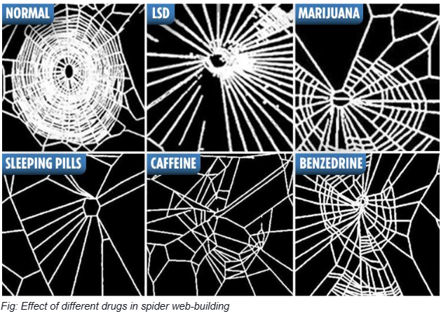
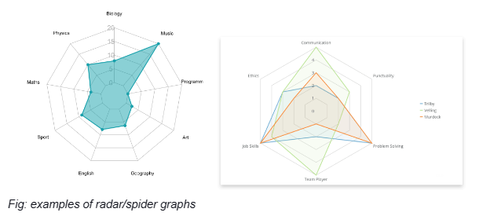

# Zedu Manifesto

*Techno-optimist species acceleration. Influenced by e/acc*

## Table of Contents

- [Unleashing the Power of the New Spice - The Path to Species Acceleration](#)
- [Section 1: Aligning Education with Purpose - The Misallocation of Capital](#)
- [Section 2: The Power of Equitable Education - Nurturing Child Prodigies for Species Acceleration](#)
- [Section 3: The Grand Vision - Education's Role in Achieving Kardashev Type 2](#)
- [Section 4: Breaking the Shackles of a Flawed System - The Crisis in Education](#)
- [Section 5: The Human-AI Partnership - A New Paradigm in Education](#)
- [Section 6: Navigating the Learning Web - Unleashing the Power of Personalized Education](#)
- [Conclusion: Unveiling a New Era of Knowledge](#)

## Unleashing the Power of the New Spice - The Path to Species Acceleration

In Arrakis's vast, unforgiving deserts, a planet on the cusp of transformation, a precious and mystical substance known as "spice" emerges from the arid sands. In the world of "Dune," it is the lifeblood of civilization, bestowing incredible power upon those who can harness it. As Arrakis holds the key to the empire's dominion, the spice, with its mystique and potency, holds the key to survival, advancement, and control.

Fast forward to the present day, and we find ourselves navigating an equally unforgiving landscape – not of sands and sandworms, but of data and algorithms. In our modern world, computing power has become the new spice, and it is no less pivotal to our trajectory as a species. Just as Arrakis dictated the rise and fall of empires, our ability to harness and control computing power shapes the future of our techno-accelerated world.

Consider a contemporary analogy: The battle for dominance over Taiwan and its computing power is the twenty-first-century equivalent of the ruthless struggles between Shaddam and the Fremen over Arrakis. In this digital realm, China, as a global superpower, assumes the role of Shaddam, attempting to assert its authority over the valuable resource - computing power - that Taiwan holds.

But who, in this narrative, are the Fremen? Who will become the architects of our future, shaping our destiny with their mastery of the new spice - computing power? The answer, my friends, lies within the realm of education and human potential.

As we venture into the complex terrain of species acceleration, we must recognize that we need more of this precious computing power. Just as Arrakis was the crucible of civilization in "Dune," computing power is the crucible of our rapidly evolving world. This manifesto is a call to arms, an invitation to explore our untapped potential, and a declaration that education is our gateway to controlling the new spice.

Join us as we embark on a journey to understand how education can accelerate us to a Kardashev-type 2 scale, where the power of computing transforms not just nations but humanity as a whole. Let us, like the Fremen of Arrakis, become the architects of our destiny, harnessing the ultimate power of our time: the power of the new spice - computing power.

## Section 1: Aligning Education with Purpose - The Misallocation of Capital

As we delve into the intricacies of our modern education systems, we find a curious paradox. Humans have solved many physiological challenges - from enhancing the performance of human athletic performance to extending our longevity through medical advancements. We've fine-tuned our physical machinery, ensuring it operates at peak performance. Yet, we stumble to understand and control the most complex and intricate machinery: the human mind.

Alzheimer's disease remains an enigma, and mental health issues plague countless individuals. It's akin to having a perfectly tuned engine but no roadmap to guide us. We've honed our physical bodies, but the mental faculties, the very machines that drive innovation and progress, remain untamed.

Similarly, we have created a remarkable machinery for generating highly educated individuals in education. The world produces a surplus of knowledge, talents, and skills - an impressive feat on a personal level. Yet, many are left adrift, without a clear sense of purpose, in a society that often measures worth by productivity and achievement. For some, even making a living becomes a daunting challenge.

The root of this predicament lies in the need for more problems to solve or opportunities to pursue. Our world teems with challenges and uncharted territories waiting to be explored. The real issue is the misallocation of capital - financial and human capital. It's a systematic misdirection, funneling resources into maintaining the status quo, artificially concocting issues, and propping up existing societal structures.

The actual scarcity we face is not the scarcity of meaningful problems or unearthing real solutions; it's the scarcity of vision. We erect artificial hurdles, forcing individuals to conform to a predefined mold and limiting our collective potential. In the process, we squander the immense potential of human capital and financial resources.

In this manifesto, we call for a radical shift in our approach to education, aligning the individual's journey with purpose and society's progress with genuine challenges. It's time to dismantle the barriers to unearthing real problems and rechannel our collective resources to pursue solutions.

The path to species acceleration lies not in maintaining the de-facto societal order but in unleashing human potential and the convergence of talent, knowledge, and purpose toward the greater good.

## Section 2: The Power of Equitable Education - Nurturing Child Prodigies for Species Acceleration

We must find a way to keep everyone pursuing species acceleration. One crucial element in this quest is equitable education. Making education accessible and affordable to all is not just a moral imperative; it is a strategic move towards harnessing the untapped potential of child prodigies who hold the keys to our collective progress.

Imagine a world where every child can receive a quality education regardless of socio-economic background. In such a world, exceptionally gifted and visionary child prodigies can thrive without financial or social constraints. These young talents are the torchbearers of innovation, the seeds of Kardashev-type 1, and the enablers of level 2.

The journey to Kardashev level 1 involves harnessing and controlling our planet's energy resources. Yet, the energy consumed by an entire society, as outlined by Kardashev, remains a physical rule that cannot be challenged. Therefore, the logical progression is to maximize the efficiency of our energy usage, which in turn requires a collective intelligence capable of tackling complex global challenges.

Equitable education creates a level playing field where prodigies can emerge from diverse backgrounds, transcending societal norms and expectations. By giving every child the tools to unlock their potential, we ensure a constant influx of innovative minds, each contributing to the efficient use of energy and the expansion of knowledge.

However, to achieve Kardashev level 1, we must do more than harness our planet's energy resources; we must also evolve our social and educational systems. Knowledge must be accessible to the gifted few and equally so to all others to harness collective wisdom for the greater good.

We live in an era where knowledge, like energy, is a resource of immense value. Yet, knowledge, too, remains underutilized and confined within boundaries. By democratizing education and allowing every individual to learn, explore, and innovate, we accelerate our progress toward Kardashev level 1. As child prodigies emerge from all corners of society, they contribute to creating sustainable, efficient systems for harnessing energy.

However, it must be noted that it's not just for child prodigies but for all. Still, this thesis aims to acknowledge the existence of prodigies in many parts of the world who were robbed of their opportunity to contribute to our civilization because of a lack of knowledge and resources.

## Section 3: The Grand Vision - Education's Role in Achieving Kardashev Type 2

In our quest for species acceleration, our ultimate destination is to reach Kardashev Type 2, a level of technological advancement where we can harness the energy output of an entire star. This grand vision may seem like a dream of science fiction, but it can become our reality with the power of education.

To achieve Kardashev Type 2, we must embark on a journey of colossal proportions, both in scale and scope. The transformative potential of education underpins the grand ideas that shape this journey. Here's how education can help us turn this vision into a reality:

1. Interstellar Energy Harnessing: We must optimize for the catalyst to understand the intricacies of astrophysics, materials science, and engineering. It empowers future generations to design and construct massive structures, such as Dyson Spheres or Swarms, capable of encircling and harvesting energy from stars.

2. Advanced Materials Science: Knowledge acquired through education fuels breakthroughs in materials science, paving the way for developing the advanced materials required for these colossal endeavors, from superconductors to nanotechnology.

3. Interstellar Travel and Communication: Advanced propulsion systems make interstellar travel and communication a reality in our quest to connect with other star systems and civilizations.

4. Planetary Engineering: Advanced planetary engineering, enabling the transformation of celestial bodies into suitable habitats for life.

5. Global Cooperation and Diplomacy: Educated minds are better equipped to foster global collaboration and diplomacy, which is essential for such a monumental undertaking. They understand the importance of working together as a worldwide community.

When we talk about empowering human civilization as a whole and conquering stars, we must spend our time and energy on something other than petty squabbles among countries fighting over finite earth resources and religion. We must find a way to transcend beyond this and push for enforced peace.

We bridge the gap between science fiction and reality, laying the foundation for a future where we can truly harness the power of stars and propel our civilization to new heights.

## Section 4: Breaking the Shackles of a Flawed System - The Crisis in Education

In our pursuit of species acceleration, we confront a formidable obstacle: the very system meant to propel us forward, our education system, is mired in a crisis. We find ourselves at a crossroads where the dream of equitable education remains elusive, undermined by a series of systemic problems that threaten the very fabric of our societal progress.

One of the most glaring issues plaguing our education system is the insidious cycle that emerges when companies are barred from using IQ as a hiring basis. To adhere to equal opportunity employer principles, companies turn to the prestige of name-brand institutions like Harvard and other Ivy League universities. This creates a distorted landscape where the elite few are celebrated, and those who can afford such institutions reap the benefits. In contrast, others are left in the shadows.

In this cycle, the educational institutions, now the gatekeepers of prosperity, raise their fees at rates that defy reason, escalating far beyond the yearly inflation rate. Banks, ever eager to profit from the aspirations of students, eagerly provide loans that shackle young minds with a lifetime of debt, an insurmountable burden they struggle to escape. This, in essence, widens the chasm of accessibility, making quality education an exclusive privilege instead of a universal right.

To maintain the illusion of value in education, a myriad of what some might call "worthless degrees" are introduced, inflating the price tags to create a façade of equality with their Ivy League counterparts. The result is an education system that's not a ladder for upward mobility but a quagmire of financial burden, perpetuating an unending cycle that undermines the very essence of education.

This crisis is a ticking time bomb, eroding the foundations of society. It fragments communities and stifles the boundless potential of those whose voices are muted by this flawed system. The consequences are far-reaching, as we squander the intellectual resources of countless brilliant minds excluded by a cycle that perpetuates inequality.

To break free from this cycle, we must embark on a transformative journey that reimagines education's purpose and role in our society. We must champion an educational system that's equitable, accessible, and capable of nurturing the talents of all individuals, irrespective of their socio-economic background.

We aim to achieve species acceleration only by dismantling the existing barriers and building bridges to knowledge. It's time to turn the page on the chapter of this crisis and author a new narrative of accelerative education.

## Section 5: The Human-AI Partnership - A New Paradigm in Education

As we strive for species acceleration, we must address the concerns of those who fear the rise of Artificial Intelligence. Rather than seeing AI as a threat, it's crucial to recognize its potential as a catalyst for human progress. When harnessed effectively, AI can be a powerful tool for assisting us in achieving our goals, not replacing us. In this context, let's distinguish between the Accels (accelerationists) and Decels (decelerationists) in the ongoing dialogue about AI.
Accels advocates for AI's swift advancement and utilization. At the same time, Decels often express concerns about the rapid integration of AI into various aspects of our lives, preferring to proceed with caution and skepticism.

To bridge the gap and solve concerns on alignment, humans must retain control in this era of the intelligence revolution. We must be the drivers, firmly in the driver's seat, directing the development and utilization of technology and capital for the betterment of humanity. We must empower ourselves to navigate and immerse in a learning journey that inspires and coaches us toward achieving our full potential.

Such an audacious learning outcome requires a novel education model that embraces human intelligence and AI synergy.

In this paradigm, an AI guides through a dynamic learning web, intuitively adapting to the student's aspirations and the ever-evolving needs of society. We envision an intelligent learning platform, our Guru-in-the-Cloud (GITC), a near-sentient tool for personalized learning.

The Guru-in-the-Cloud will empower students to explore non-linear learning paths. It will help them navigate a flexible learning journey, whether progressing slowly or accelerating rapidly based on individual needs and aspirations. This revolutionary approach ensures that education becomes a dynamic force, a means to break away from the constraints that limit human potential, and a gateway to species acceleration.

By forging a partnership between humans and AI, we unleash the full potential of our species. Together, we can transcend the boundaries that have held us back.

We have the power to shape a future where human intelligence and artificial intelligence work in harmony, where human ambition and technological innovation merge seamlessly, and where, as a species, we become the true architects of our destiny.

## Section 6: Navigating the Learning Web - Unleashing the Power of Personalized Education

Before delving into the transformative concept of the Guru-in-the-Cloud (GITC), let's embark on a journey through the learning web. This vision redefines how we acquire knowledge and connect with the world.

### Wikipedia Link Surfing: A Gateway to Unconventional Learning:

Imagine education as an expedition into the digital realm, much like navigating the labyrinthine connections of Wikipedia. Every subject and topic in this space is a node in a vast web of interconnected knowledge.
Just as you lose yourself in a captivating article on Wikipedia, you can dive into the realm of learning web nodes, where curiosity becomes your compass, and exploration is your guide.
With each click, you uncover a new dimension of knowledge, seamlessly transitioning from history to science, mathematics, and art. This unconventional learning method mirrors the spontaneous curiosity of a child, uninhibited by rigid curricula.

### The Creation of a Learning Web:

- The learning web is a dynamic and interconnected ecosystem of knowledge. It's constructed to be non-linear, adaptive, and as diverse as the spectrum of human interests.
- At its core, the learning web comprises nodes representing a subject or topic. These nodes are linked together, forming a complex network of educational opportunities.
- Rather than following prescribed paths, students can explore to leap from one node to another. These connections, like the interwoven strands of a spider's web, allow for boundless discovery.
- As learners navigate this intricate web, they craft their unique learning journey fueled by passion and curiosity. Every individual's path becomes a masterpiece, reflecting their intellectual and creative inclinations.

### The Spider Web Experiment and Its Positive Contraries:

- To understand the transformative potential of GITC, let's first reflect on a curious experiment involving spiders and drugs. These experiments revealed that different medications could lead to significant variations in the structure and design of spider webs.

- While these experiments highlight the influence of external factors on intricate behavior, they do not conclude that web-building is isolated to a specific part of a spider's brain. Instead, they illustrate that behavior is a complex interplay of instinct, sensory perception, and the influence of external factors.

- In the context of GITC, it is the positive contrary to the effects of drugs on spider web-building behavior. Rather than altering or impairing the mind, GITC enhances and amplifies the learning experience. It empowers students to chart their non-linear learning journey, like surfing Wikipedia, celebrating individuality, and equipping them to create their unique educational path.

### The Guru-in-the-Cloud (GITC) and Personal Radar Graphs:

- Within this vision of a boundless learning web emerges the Guru-in-the-Cloud (GITC). GITC is not just a platform but a transformational force that amplifies the spirit of personalized education.

- GITC is poised to guide students through the learning web as a guardian of knowledge. It serves as a beacon of wisdom, an educational compass, and a tireless companion on the quest for knowledge.

- GITC introduces the concept of personalized, non-linear learning, where each student is empowered to carve their unique path through the learning web. It's an educator, counselor, and advocate for every individual, embracing the diversity of aspirations and potentials.

- Through GITC, students embark on a journey that celebrates individuality, empowers self-directed exploration, and fosters a deep and lasting love for learning. It's a tool that transcends the confines of conventional education, creating a boundless frontier where each student's story is as unique as their fingerprint.

- But GITC is more than a guide; it is a trained artist. As students progress through the learning web, GITC meticulously crafts a personal radar graph for each learner. This radar graph is not a mere reflection of academic achievements but a multifaceted illustration of one's skills, emotional intelligence, and personal strengths.

- Just as a spider weaves its unique web, each student's radar graph tells the story of their journey, mapping their distinctive abilities and potential. It becomes a testament to their growth, individuality, and the boundless possibilities they embrace in their quest for knowledge.

As we venture into the world of Guru-in-the-Cloud, let's remember that it is within the learning web's rich tapestry that GITC thrives. Together, they herald a future where education is not a linear path but an intricate web of discovery, where learning is not a chore but an adventure, and where each learner is not a statistic but a celebrated individual on their journey of enlightenment.

## Conclusion: Unveiling a New Era of Knowledge

As we draw the curtains on this manifesto, we find ourselves at the precipice of a transformative age, where education, like never before, can elevate humanity to Kardashev-type 2 to accelerate the essence of our existence.

We have ventured through the intricate web of interconnected knowledge, where learning is a journey as unique as each individual, curiosity knows no bounds, and pursuing knowledge is an adventure waiting to be embraced. The Guru-in-the-Cloud (GITC) emerges as a guiding light, a counselor, and a tireless companion in this extraordinary odyssey.

GITC is more than a tool; it embodies a philosophy that is a testament to the enduring spirit of human curiosity, innovation, and individuality. It represents the positive contrary to the effects of external influences, a force that enhances and amplifies our learning experiences, making each learner's journey as distinctive as a fingerprint.

In the era of GITC, education is not a linear path but an intricate web of discovery. Learning is not a chore but an adventure. Each learner is not a statistic but a celebrated individual on their journey of enlightenment.

As we navigate the labyrinthine connections of this new educational frontier, let's remember that knowledge is the ultimate catalyst for change, progress, and human evolution. With the power of the learning web and GITC, we embark on a journey where each individual can reach their full potential, where the world is not just for the elite but for every aspiring mind.

The transformation begins now. We, the torchbearers of knowledge, are entrusted with sculpting the future. With GITC as our guide and the learning web as our canvas, let's illuminate the world with the brilliance of human potential, celebrate the diverse tapestry of our intellect, and propel ourselves to the realms of Kardashev-type 2 and beyond.

As we step forward into this new era of knowledge, let's unite in our quest for enlightenment, celebrate the boundless possibilities that GITC unveils, and embrace a future where education knows no bounds and knowledge is the cornerstone of human progress.

The journey has just begun, and the possibilities are infinite. Together, we shall accelerate, we shall ascend, and we shall triumph. Onward to the next horizon, where the very essence of our existence accelerates to meet the stars.
